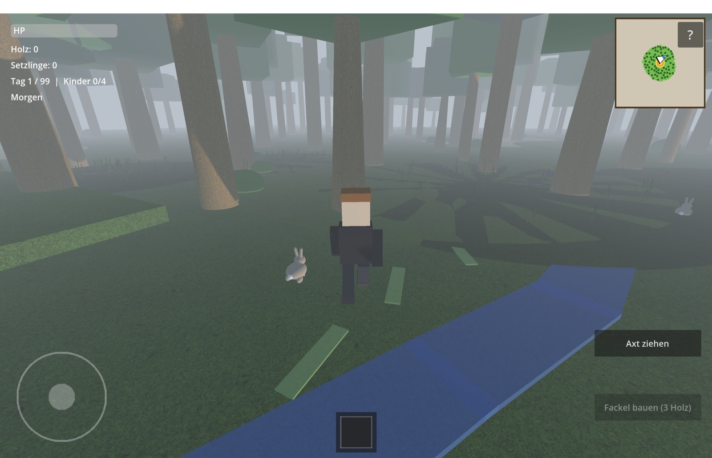

# 99 Jahre im Wald 🌲🔥

Ein 3D-Survival-Spiel für iPad und PC, gebaut mit **Godot 4** — inspiriert von „99 Nights in the Forest" (Roblox).

Überlebe 99 Nächte im dunklen Wald, sammle Holz, halte das Lagerfeuer am Leben — und rette die **4 vermissten Kinder** aus der Unterwelt, um die Nächte zu verkürzen!



## Features

- 🌗 **Tag/Nacht-Zyklus** — nachts erwacht der Hirsch und jagt dich
- 🔥 **Lagerfeuer** als sichere Zone, mit Werkbank zum Craften
- 🪓 **Holz hacken** mit 3 Axt-Stufen (Stein, Eisen, Stahl), Bäume respawnen, Setzlinge pflanzen
- 🐇 **Tiere jagen** — Hasen und Wölfe droppen Fleisch, das man am Feuer braten und essen kann
- 🌀 **Portal in die Unterwelt** — eine Höhlenwelt mit leuchtenden Kristallen, Kultisten und Fledermäusen
- 👧 **4 vermisste Kinder retten** — jedes gerettete Kind verkürzt die nötigen Nächte um 20
- 🏗️ **Bauen:** Bett, Zaun, Holzwand, Truhe
- 💾 **Autosave** — das Spiel speichert automatisch, Reset über das Cheat-Menü (F1)
- 📱 **Touch-Steuerung** für iPad: virtueller Joystick, Pinch-Zoom, kontextabhängige Buttons
- 🎵 Prozedural generierte Sounds und Musik — keine externen Audio-Dateien

## Spielen

**PC (Entwicklung):** Godot 4.6+ installieren, dann:

```bash
godot --path .
```

**iPad:** Das Projekt mit [Xogot](https://xogot.com) (Godot für iPad) direkt aus diesem Repo öffnen — `project.godot` liegt im Repository-Root. Beim ersten Öffnen importiert Xogot die Assets automatisch.

## Steuerung (PC)

| Taste | Aktion |
|-------|--------|
| W A S D / Pfeiltasten | Bewegen |
| Shift | Sprinten |
| Leertaste | Springen |
| Pfeil Links/Rechts | Kamera drehen |
| Strg + Pfeiltasten | Kamera neigen / schnell drehen |
| + / − / Mausrad | Zoom (bis First-Person) |
| Rechte Maustaste + Maus | Kamera drehen |
| Q | Axt ziehen / wegstecken |
| E | Aufsammeln / Baum hacken / Tier angreifen / Kind retten |
| F | Setzling pflanzen |
| G | Ausgewähltes Item ablegen |
| T | Fackel anzünden / ausmachen |
| P | Item platzieren (Bett, Zaun, Wand, Truhe) |
| B | Werkbank öffnen (in der Nähe) |
| C | Fleisch braten (am Lagerfeuer) |
| V | Gebratenes Fleisch essen |
| Tab / 1–9 | Inventar-Slot wechseln |
| ? | Hilfe-Fenster mit allen Befehlen |
| F1 | Cheat-Menü (Entwickler) |

Auf dem iPad erscheinen stattdessen kontextabhängige Touch-Buttons, die Hotbar-Slots sind antippbar. **Rennen:** Joystick ganz nach außen drücken. **Springen:** ⬆-Button unten rechts.

## Projekt-Struktur

- `scenes/main.tscn` — einzige Szene, alles Weitere wird prozedural erzeugt
- `scripts/` — GDScript-Dateien (Spieler, Gegner-KI, Weltgenerierung, UI)
- `assets/textures/` — CC0-Texturen von [ambientCG](https://ambientcg.com) (siehe `assets/textures/LICENSE.md`)
- `game-design.md` — Design-Dokument mit Roadmap
- `PROGRESS.md` — fortlaufendes Entwicklungs-Log

Alle 3D-Modelle (Spieler, Tiere, Monster, Gebäude) sind **prozedural in GDScript gebaut** — es gibt keine externen 3D-Assets.
